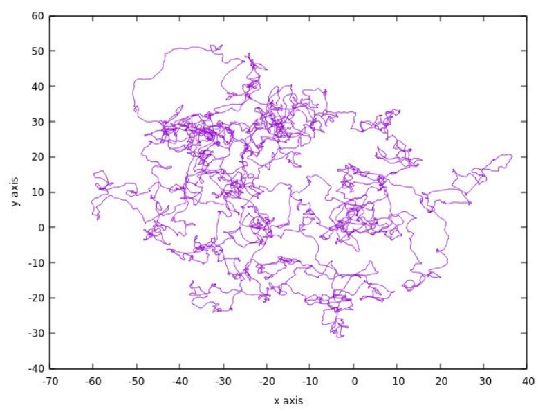

# Coil Globule Transition: Langevin and Brownian Dynamics

**Problem Statement:** Coil Globule Transition of ideal chain polymers, is studied using Langevin and Brownian Dynamics

**Tools:** Fortran, MATLAB(For Visualization of Outputs)

In the current project, a custom simulation code in Fortran from first principles, without utilizing any pre-built simulation tools or frameworks is executed. The project follows using both Langevin and Brownian dynamics to simulate the coil globule phase transition among the single stranded polymers. On running the code above one gets, the following results,
* Simulation Results on the Dynamics of a Brownian Particle
* Results on the Statistical Mechanics of Polymer Dynamics
* Theory and Simulation Results on Coil-Globule Transition

    <h3>Maxwellian Loading of Particles</h3>
    
A sample result on achieving Maxwellian loading of particles is shown below:

    

    <h3>Particle Trajectory</h3>
    
A sample result on the trajectory of particles is shown below:

    

## Contact
Feel free to contact me at:
joydeep.das39@gmail.com

## Portfolio
https://joydeepdascode.github.io/Joydeep

